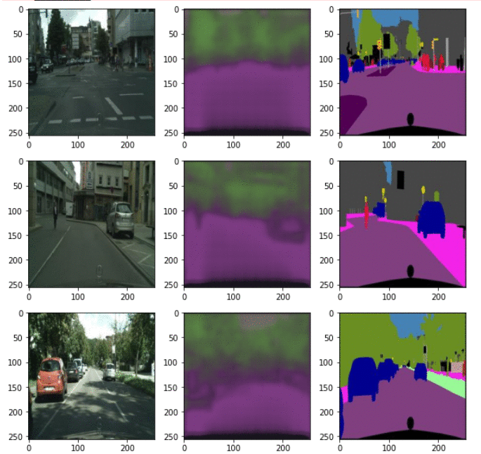

# Cityscape-Semantic-Segmentation

Semantic-Segmentation || UNet || PyTorch || Self Driving Cars

Performed semantic segmentation on Cityscape Dataset.  
Applied UNet Architecture.

### [Kaggle link](https://www.kaggle.com/code/sudhupandey/cityscape-segmentation-unet-pytorch)

---

 

# Learning of Model

